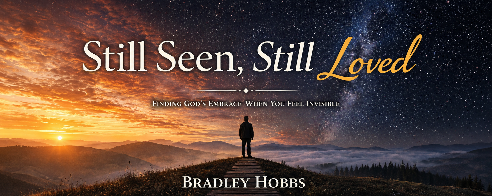

# Still Seen, Still Loved



## About

*Still Seen, Still Loved* by Bradley Hobbs is a faith centered journey for hearts that have felt invisible, overlooked, silenced, or misunderstood.

Through Scripture, reflection, encouragement, and deeply personal themes, this book speaks to readers searching for hope, belonging, courage, and the reminder that God's love reaches every hidden place.

This project presents the book as an immersive reading experience through GitHub Pages.

---

## Themes

• Being seen during seasons of silence  
• Courage in hidden places  
• Identity and belonging  
• Conversations that heal  
• Scripture through the lens of grace  
• Faith, authenticity, and hope  

---

## Reading Journey

Publication Page

Dedication

Foreword

Prologue

Chapter 1  
For the Ones Watching Quietly

Chapter 2  
The Weight of Being Less Than

Chapter 3  
Closets Built by Fear, Not God

Chapter 4  
When Conversation Becomes a Lifeline

Chapter 5  
Supremacy Wears Many Disguises

Chapter 6  
Scripture as a Mirror, Not a Weapon

Chapter 7  
Stepping Into the Light of Your Own Truth

Epilogue

About the Author

A Meaningful Daily Prayer

---

## Site Structure

```text
still-seen-still-loved/
│
├── index.html
├── contents.html
├── publication.html
├── dedication.html
├── foreword.html
├── prologue.html
├── chapter1.html
├── chapter2.html
├── chapter3.html
├── chapter4.html
├── chapter5.html
├── chapter6.html
├── chapter7.html
├── epilogue.html
├── about.html
├── prayer.html
├── footer.html
├── banner.png
└── README.md
```

---

## Live Site

https://brad-hobbswd.github.io/stillseen-still-loved

---

## Author

Bradley Hobbs

"You are seen. You are loved. You are enough."